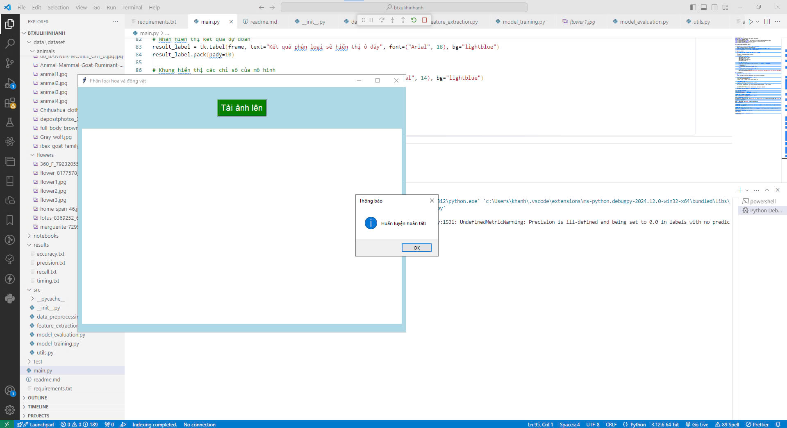
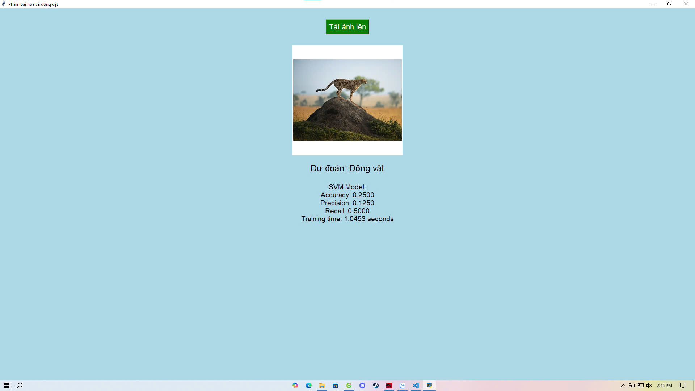

# Phân Loại Ảnh Hoa và Động Vật

Dự án này sử dụng các mô hình học máy như SVM (Support Vector Machine) để phân loại ảnh thành hai nhóm: **Hoa** và **Động vật**. Giao diện người dùng được xây dựng bằng **Tkinter**, cho phép người dùng tải ảnh lên từ máy tính và hiển thị kết quả phân loại theo thời gian thực.

## Chức năng chính

- **Phân loại ảnh**: Dự án sử dụng mô hình SVM để phân loại ảnh thuộc hai nhóm là hoa và động vật.
- **Giao diện đồ họa**: Người dùng có thể dễ dàng tải ảnh từ máy tính lên thông qua giao diện đơn giản và thân thiện.
- **Hiển thị chỉ số mô hình**: Sau khi ảnh được phân loại, giao diện sẽ hiển thị các chỉ số đánh giá mô hình như độ chính xác (accuracy), độ chính xác dự đoán (precision), độ hồi tưởng (recall), và thời gian huấn luyện.

## Ảnh Demo

Dưới đây là một số ảnh chụp màn hình giao diện chương trình:

### Giao diện chính trước khi tải ảnh lên

- Giao diện ban đầu với nút "Tải ảnh lên", nơi người dùng có thể chọn ảnh từ máy tính của mình.
- Khung hiển thị ảnh được chọn cùng với kết quả phân loại.

### Giao diện sau khi ảnh đã được tải lên và phân loại

- Sau khi người dùng chọn ảnh, ảnh sẽ được hiển thị trên giao diện, và kết quả phân loại (hoa hoặc động vật) sẽ được hiển thị ngay bên dưới.

## Cấu trúc dự án

